# MaT (Maintenance Web Tool)

Prezentare video : https://www.youtube.com/watch?v=t5dqCMFIo1M

## Content
1. [Authors](#authors)
2. [Introduction](#introduction)  
   1. [Purpose](#purpose)  
   2. [Document Convention](#document-convention)  
   3. [Target Audience](#target-audience)  
   4. [Bibliography and References](#bibliography-and-references)  
3. [General Description](#general-description)  
   1. [Product Perspective](#product-perspective)  
   2. [Product Features](#product-features)  
   3. [User Classes and Characteristics](#userData-classes-and-characteristics)  
   4. [Operating Environment](#operating-environment)  
   5. [User Documentation](#userData-documentation)  
4. [Application Interface](#application-interface)  
   1. [User Interface](#userData-interface)  
      - [Home page](#home-page)  
      - [Login page](#login-page)  
      - [Registration page](#registration-page)  
      - [Forget-Password page](#forget-password-page)  
      - [Reset-Password page](#reset-password-page)  
      - [Calendar page](#calendar-page)  
      - [Appointment page](#appointment-page)  
      - [Profile page](#profile-page)  
      - [Admin page](#admin-page)  
   2. [Hardware Interface](#hardware-interface)  
   3. [Software Interface](#software-interface)  
   4. [Communication Interface](#communication-interface)  
5. [Characteristics of the Application](#characteristics-of-the-application)  
   1. [Account Management](#account-management)  
   2. [Admin Section](#admin-section)  
   3. [Session Management](#session-management)  
6. [Technologies for Protection and Security](#technologies-for-protection-and-security)  

        
## Authors
Second year students at the Faculty of Computer Science, UAIC, group B1

- Radu Marian-Sebastian - [radumariansebastian29@gmail.com](mailto:radumariansebastian29@gmail.com)

- Pintilie David-Mihail - [pintiliedavid06@gmail.com](mailto:pintiliedavid06@gmail.com)

## Introduction
- C4 diagrams

    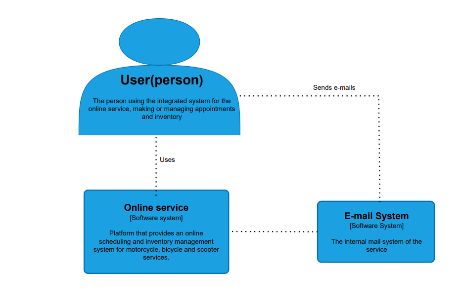
    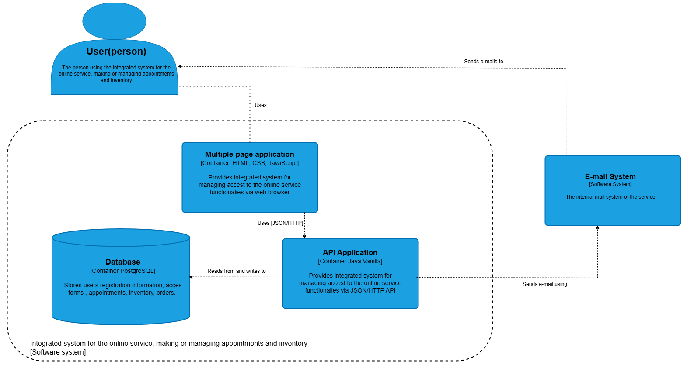

- Schema Database

    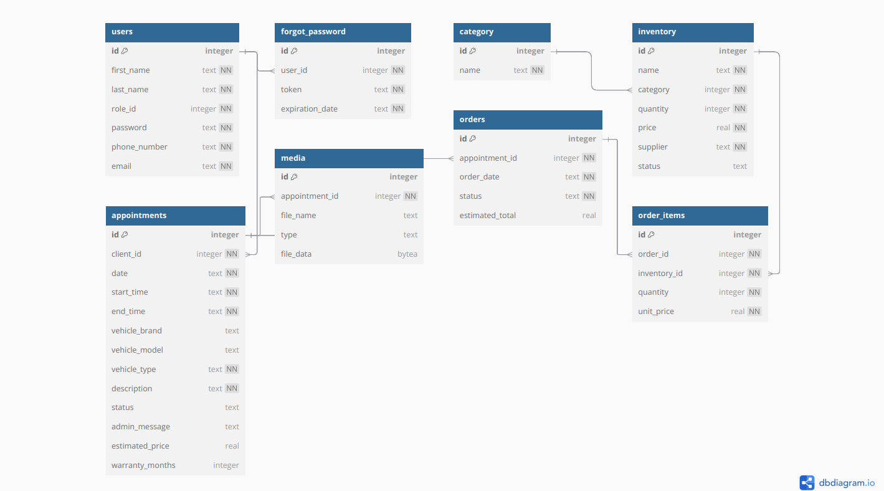
## Purpose

This project provides an **online scheduling** and **inventory** management system for motorcycle, bicycle and scooter (electric or traditional) services. The purpose of the application is to:

- Allow them to consult the available calendar and quickly book a time slot, filling out a form with dates, times and details about the technical problem, including attaching photos or videos.
- Provide administrators with a control panel where they can **approve** or **reject** appointments, with personalized messages (e.g. "We don't have the necessary items in stock, come back in Z days") and add useful information such as estimated price or warranty.
- Keep track of items stocks.
- Import and export data in **CSV** formats about items and orders.

## Document Convention
- This document is written in Markdown format. The document is structured in sections, each section containing a title.
- This document follows the template for software requirements documentation according to the `IEEE Software Requirements Specification`.

## Target audience
The platform is primarily aimed at:

- **Owners and administrators of two-wheeler service stations**
PFA/SRL contractors who manage repair shops for motorcycles, bicycles or scooters (electric or traditional). They need a centralized tool for scheduling orders, monitoring items stocks, as well as for quickly generating reports in CSV format.

- **Mechanics and service technicians**
Specialists who want immediate access to the details of each appointment (date, time, problem description, attached photos/video) and who want to update the status of interventions and the history of work directly from the web interface.

- **End customers (two wheels)**
Bicyclists, scooters and motorcyclists who want an intuitive, self-service appointment, with the possibility of attaching photos/video to describe the malfunctions and the first notifications by email of approval, rejection or price offer and warranty.

## Bibliography and references

- Dr. Buraga Sabin-Corneliu, Dr. Andrei Panu, [Web Technologies](https://edu.info.uaic.ro/web-technologies/), FII UAIC
- Dr. Captarencu Oana, [Web Technologies Laboratory](https://profs.info.uaic.ro/oana.captarencu/tw/), FII UAIC
- [IEEE Software Requirements Specification](https://ieeexplore.ieee.org/document/278253)
- [REST API Tutorial](https://www.restapitutorial.com/)
- [HttpServer Java Class](https://docs.oracle.com/en/java/javase/23/docs/api/jdk.httpserver/com/sun/net/httpserver/HttpServer.html)
- [W3Schools](https://www.w3schools.com/)
- [Markdown Guide](https://www.markdownguide.org/)

## General Description
The **Maintenance Web Tool** system is a standalone web application, designed to easily integrate into existing workflows of motorcycle, bicycle and scooter services. 
1. **Modular architecture**
- The application is structured on three main components:
    - **Web interface** (frontend) — built with fundamental technologies (HTML, CSS and Javascript), allows WEB and administrators access on desktop or mobile.
    - **REST API**) — exposes programming, management, import/export stock data (inventory respectively information about completed orders).
    - **Relational database** — stores programs, users, products in stock and order history.
        - **Email service** (SMTP): automatically sends notifications of confirmation, approval or rejection of the programming.
        - **Multimedia storage**: stores files (images, clips) attached to the purchase in the DB.

2. **Import/export interfaces**
- Import data in **CSV** format for adding new items/or updating stock
- Export data in **CSV** formats for the history of completed service orders.

### Product perspective
Maintenance Web Tool is an independent web system that can be installed on the service's own server and offers standardized data import and export (CSV). The application has a responsive frontend and a REST API backend. The system communicates with external SMTP email services for notifications. Through these mechanisms, the tool works both autonomously and as an integrated module in an existing software suite, ensuring a transparent and secure data exchange.
### Product features
- Calendar view with real-time service availability
- Create, modify and cancel appointments with attached descriptions, photos and videos
- Automatic email notifications for confirmation, approval or rejection
- Administrator approval/rejection flow, with personalized messages and details (estimated price, warranty)
- Parts inventory management
- Data import (inventory) in CSV formats
- Data export related to customer orders CSV

### User classes and features
#### Client  
- Variable technical level, from beginner to enthusiast
- Intuitive interface, compatible with desktop and mobile
- Can attach multimedia files (photos, videos) to the scheduling form
- Receive automatic email notifications regarding scheduling status

#### Administrator / Proprietar Service / Mecanic
- Advanced knowledge of the operational and financial flow of the service
- Full rights: approve or reject appointments with personalized messages
- Manage parts stocks and place orders with suppliers
- Needs report exports in CSV, JSON and PDF formats for accounting and analysis
### Operating environment
- Maintenance Web Tool can be used on any device with a Web Browser that supports HTML5, CSS and Javascript.

### User documentation
- Users can consult this document to understand the functionalities and operating mode of the `MaT` application.

## Application interface

### User interface

#### Home page  
- The home page welcomes users with a clear hero section and quick links to key functions (book appointment,calendar section).
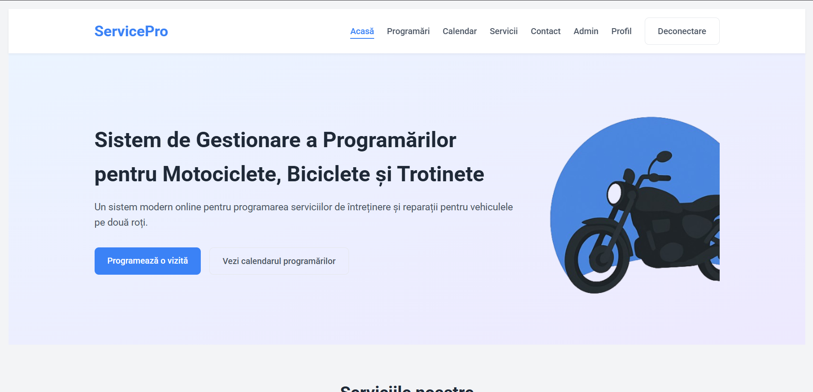  
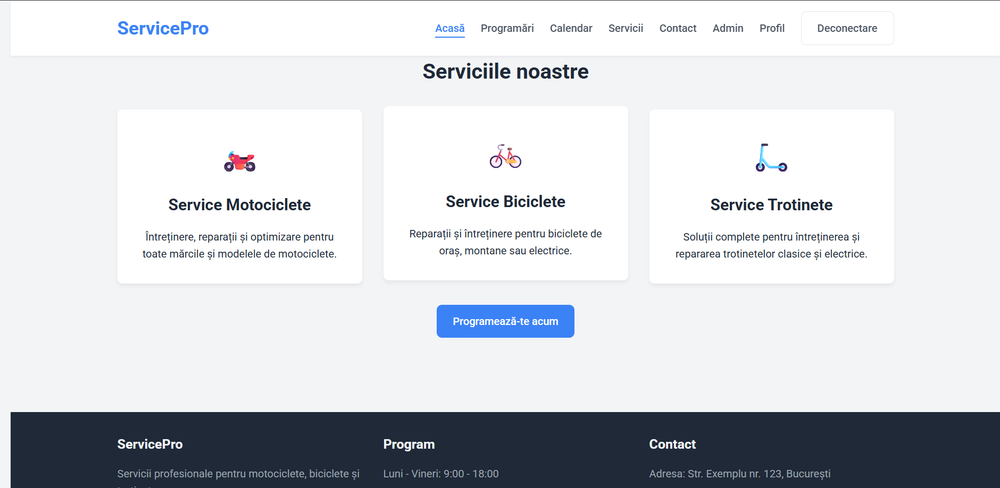  

#### Login page  
- This page provides a simple, secure form for users to sign in with email and password. It includes client-side validation and a “Forgot Password?” link for account recovery.
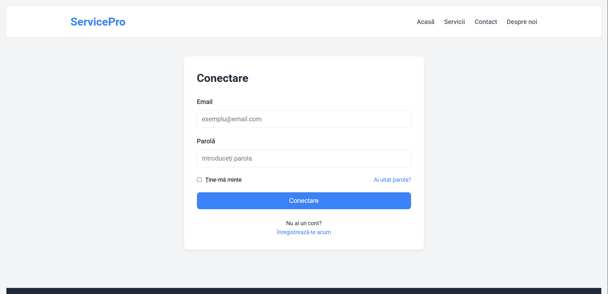  

#### Registration page  
- Users can create a new account by entering their name, email, phone number, and choosing a password. Real-time checks ensure valid email format and strong password criteria.
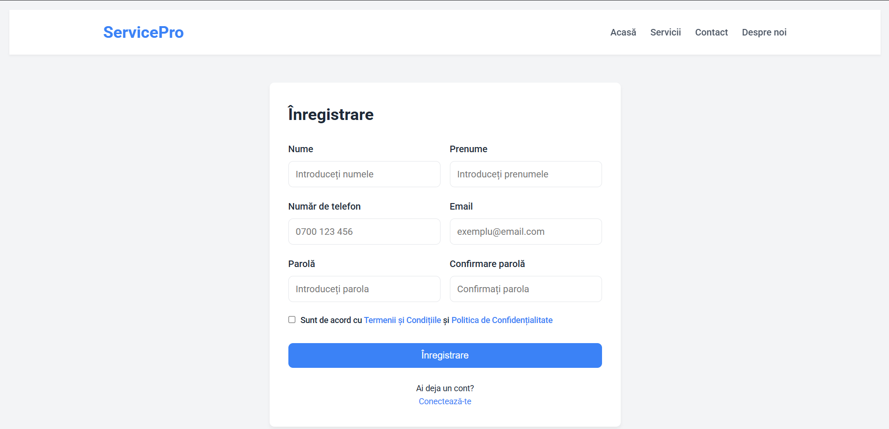  

#### Forget-Password page  
- Clients enter their registered email to request a password reset link. The page confirms when the reset email has been dispatched.
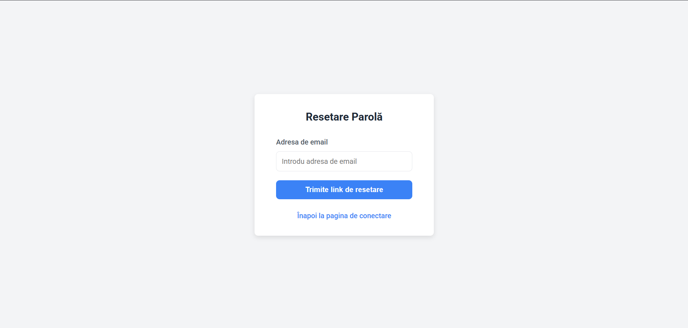  

#### Reset-Password page  
- The reset form requires users to enter and confirm their new password. Password strength feedback guides them to choose a secure credential.
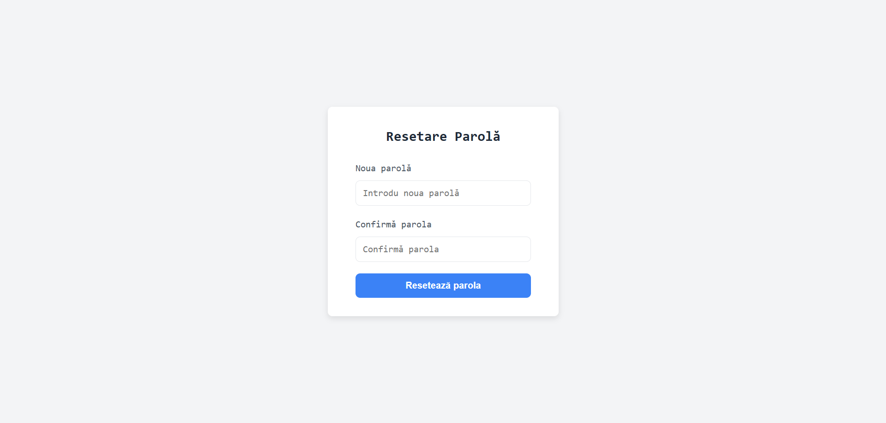  

#### Calendar page  
- An interactive calendar displays available time slots by day. Users click a slot to initiate appointment and see real-time availability updates.
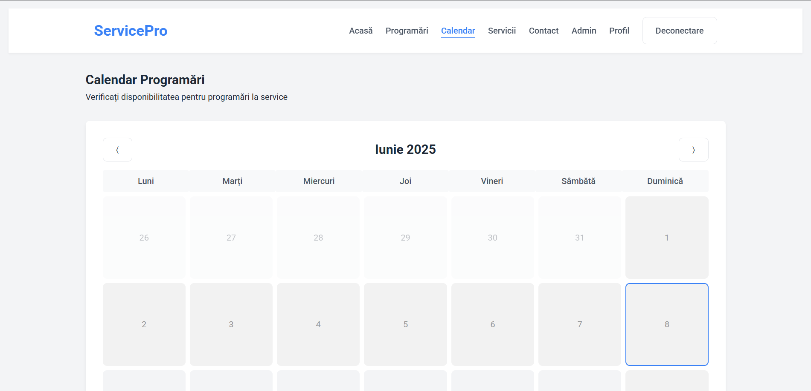  
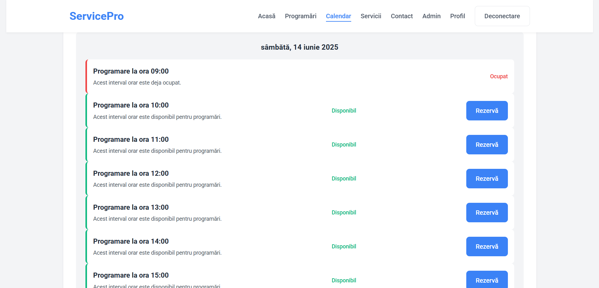  

#### Appointment page  
- This form collects vehicle details (type, model), a problem description, and allows drag-and-drop uploads of images or video. Inline help tips guide users through each field.
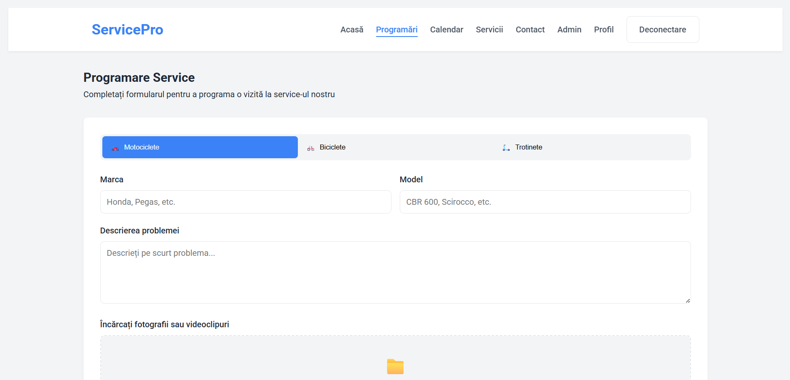  
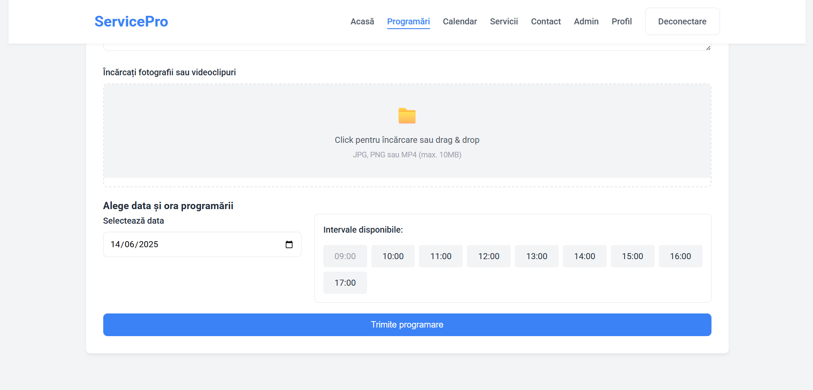  

#### Profile page  
##### Info  
- The profile info section shows userData details and account settings. Edit buttons let users update their info.  
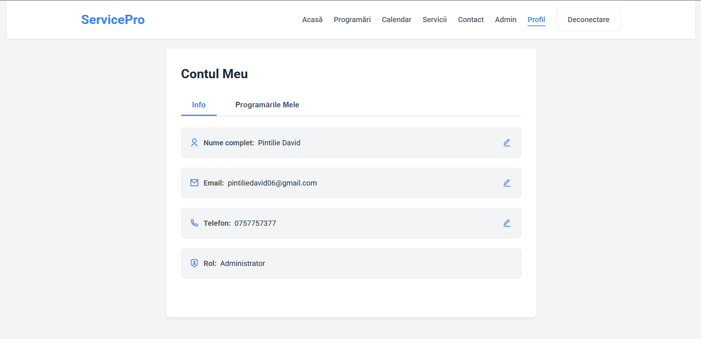  
##### Appointments section  
- Lists all upcoming and past appointments with status badges. Users can cancel open appointments or confirm modifications requested by the admin.
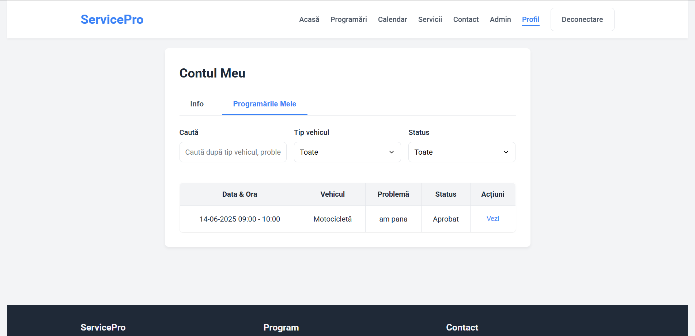  

#### Admin page  
##### Management Appointment page  
- Admins see a sortable table of all service requests with filters for status. Action buttons open modals to approve with notes or send a custom rejection message.  
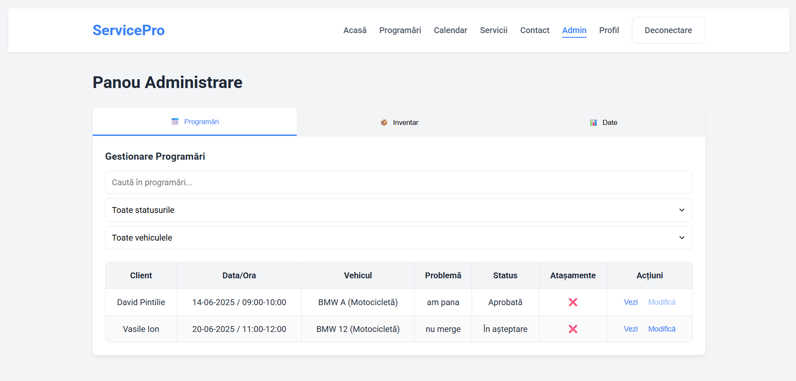  
##### Inventory page  
 - Displays current stock levels and items catalog. Inline editing and low-stock alerts help admins reorder before supplies run out.  
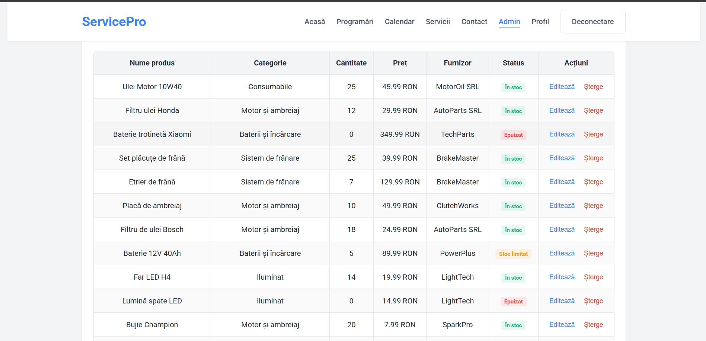  
##### Data import/export page  
- Provides tools to upload CSV files for batch imports and to download filtered reports as CSV. A field-mapping preview ensures data aligns correctly.  
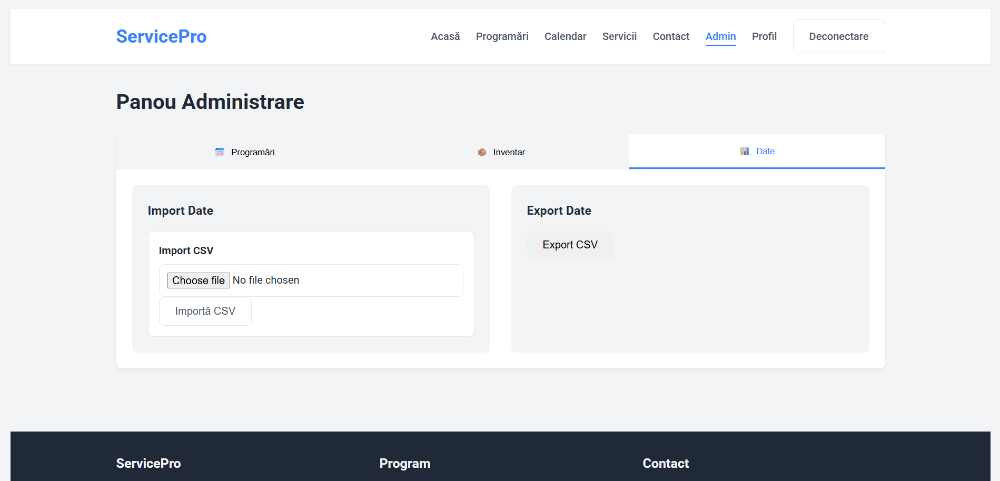  

### Hardware interface
- The application will run on a server.
- The application will require an internet connection to send emails.
- The application will require a computer or mobile device to access the userData interface.
### Software interface
- The application will use a REST API to communicate with the server.
- The application will use HTML CSS for awesome design.
- The application will use JavaScript to interact with the userData interface.
### Communication interface
- The application will use HTTP to communicate with the server.
- The application will use JSON to send and receive data.
- The application will use multiform-data for send image/video data to server.

## Characteristics of the application

### Account Management
#### Description and Generalities
- A userData can register by choosing an email,a phone number, a password, first name, and last name. They can authenticate themselves by only needing the email and password.
- A userData can see all available time slots by day and can make an appoitment.
#### Information Update
- When a new userData is created, their credentials are entered into the database. Similarly, when the userData decides to modify their credentials, the new values are also updated in the database.
#### Operating Conditions
- To modify their credentials, the userData must be authenticated.
- To authenticate, the userData needs an account registered in the database.

### Admin Section
#### Description and Generalities
- The Admin Section is intended for users with administrator rights, offering comprehensive control over service operations including appointment approval or rejection with custom messages. From the dashboard, admins can manage inventory levels, and import or export data in CSV format.
#### Information Update
 - When the admin change the status about all appointments,the updates are inserted into DB.Same about inventory items(price,level/stock,suppliers).
#### Operating Conditions
- The userData must be authenticated.
- The userData must have admin rights.
### Session management
#### Description
- The application will have a session management system that will allow users to log in and log out.
- The session management system will be implemented using JWT tokens.
- The session management system will have a timeout of 1 day.
#### Data flow
- The userData will log in using the login form.
- The server will validate the userData's credentials.
- The server will generate a JWT token and send it to the userData.
- The userData will store the token in the local storage.
- The userData will send the token in the header of certain requests.
#### Requirements and constraints
- The userData must have an account to log in.
- The userData must have a valid email and password to log in.
- The userData must have a valid JWT token to access the application.
- The userData must have a specific role in order to access certain pages.
## Technologies for protection and security
### Description
- The application will encrypt the userData's password before storing it in the database.
- Authorization is done with `JWT token`.
- Passwords are hashed with `Bcrypt`.
- The application is using prepared statements to prevent `SQL injection`.